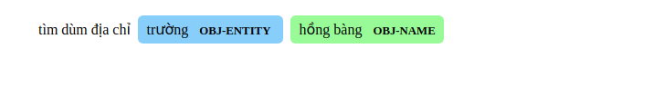

# visualize_SF_result

# Cách sử dụng

Hàm `convert_sf_result_to_html` nhận đầu vào là một chuỗi kết quả của hệ thống Slot Filling / NER và trả về là một figure tag. Ví dụ: 

```python
string = 'tìm:O, dùm:O, địa:O, chỉ:O, trường:OBJ-ENTITY, hồng:OBJ-NAME, bàng:OBJ-NAME'
output = convert_sf_result_to_html(string)
```
Khi đó, `output` sẽ là:

```html
<figure style="margin-bottom: 6rem">
<div class="entities" style="line-height: 2.5; direction: ltr">tìm dùm địa chỉ 
<mark class="entity" style="background: #87CEFA; padding: 0.45em 0.6em; margin: 0 0.25em; line-height: 1; border-radius: 0.35em; box-decoration-break: clone; -webkit-box-decoration-break: clone">
    trường
    <span style="font-size: 0.8em; font-weight: bold; line-height: 1; border-radius: 0.35em; text-transform: uppercase; vertical-align: middle; margin-left: 0.5rem">OBJ-ENTITY</span>
</mark>
<mark class="entity" style="background: #98FB98; padding: 0.45em 0.6em; margin: 0 0.25em; line-height: 1; border-radius: 0.35em; box-decoration-break: clone; -webkit-box-decoration-break: clone">
    hồng bàng
    <span style="font-size: 0.8em; font-weight: bold; line-height: 1; border-radius: 0.35em; text-transform: uppercase; vertical-align: middle; margin-left: 0.5rem">OBJ-NAME</span>
</mark>
</div>
</figure>
```

Khi nhúng figure tag này vào trang html:

